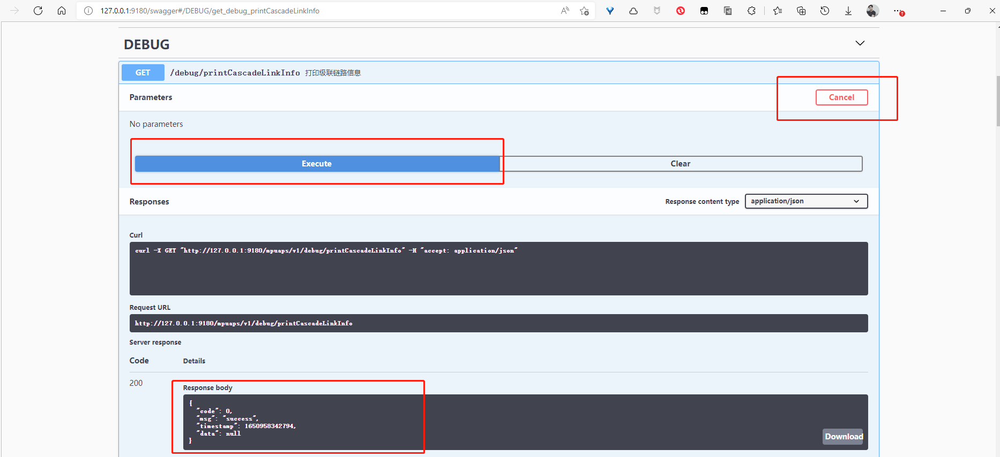

## 概述

本文主要描述`mpuaps`显控应用代理的开发与维护。
本文内容供相关测试人员和开发人员参考。


## 简要说明

**简介**：全称`MPU Application platform services`，显控应用平台。基于goframe开发的显控后端业务平台。

**目的**：在现有的c++版本`mpuserver`脚手架不完善，协议设计复杂，上开发一些新功能效率比较低，且会影响现有`mpuserver`的稳定性。所以打算把一些应用层的业务功能抽出来，在`mpuserver`之上，用上层语言做业务开发，`mpuserver`只保留一些基本切矩阵功能。可以提高整个显控平台的稳定性，以及方便扩展开发新的业务功能。

**进度**：现阶段已实现了 `登录认证`、`用户管理`、`角色管理`、`权限管理`、`在线用户管理`、`登陆日志`、`系统操作日志`、`告警日志`、`设备上下线日志`、`信号源管理`、`大屏调度`、`预案调度`、`显控级联`、`机箱冗余`、`主控冗余` 相关功能。

**todo**：`...` 


## 业务流程


- `mpuaps   `显控应用代理
- `mpuserver`显控平台主业务
- `web      `客户端 

**说明：**
显控平台协议栈`libmsplib.so`基于cnt协议扩展实现grpc服务，对外提供rpc接口。grpc协议栈中使用`grpcuser`账户自动登录到主业务。代理通过显控提供的grpc接口向显控平台获取数据。
grpc服务控制代码：`libmsplib.so`      `./40-servers/msplib/source/ctrl_grpc.cpp`
grpc协议栈实现：    `libmspgrpc.so`    `./40-servers/msplib/libany/msplibgrpc`

网络信号源通过Ftp服务下载读取smmgr的数据库初始化，之后代理网络信号的状态同步和增删改同步通过订阅主业务`mpuserver`通知消息(grpc服务提供订阅接口)来进一步保持数据同步。


## 工程目录

工程目录在goframeV1.16.6框架生成目录之上做了扩展。与新版本goframeV2.0↑有些出入。

```bash
/
├── app
│   ├── common
│   │   ├── global         #全局数据定义
│   │   ├── middleware     #全局Http请求处理过滤器
│   │   ├── utils          #常用工具包(封装通用工具接口)
│   │   ├── task           #定时任务栈
│   │   ├── errcode        #错误码定义管理
│   │   ├── define         #通用功能Http接口输入输出数据模型
│   │   ├── model          #通用功能数据表对应数据模型
│   │   ├── dao            #通用功能数据库ORM
│   │   ├── api            #通用功能Http接口
│   │   ├── service        #通用功能业务
│   │   └── common.go      #模块入口
│   │
│   ├── system
│   │   ├── define         #系统功能Http接口输入输出数据模型
│   │   ├── model          #系统功能数据表对应数据模型
│   │   ├── dao            #系统功能数据库ORM
│   │   ├── api            #系统功能Http接口
│   │   ├── service        #系统功能业务
│   │   └── system.go      #模块入口
│   │
│   ├── mpusrv
│   │   ├── define         #显控功能Http接口输入输出数据模型
│   │   ├── model          #显控功能数据表对应数据模型
│   │   ├── dao            #显控功能数据库ORM
│   │   ├── api            #显控功能Http接口
│   │   ├── service        #显控功能业务
│   │   └── mpusrv.go      #模块入口
│   │
│   ├── Othe_module        #扩展其他业务模块
│   │   ├── define
│   │   ├── model
│   │   ├── dao
│   │   ├── api
│   │   ├── service
│   │   └── othe_module.go
│   │
│   └── app.go
│ 
├── config
│   ├── config.toml        #gf默认配置文件
│   ├── config-local.toml  #本地调试配置文件
│   ├── config-dev.toml    #开发环境配置文件
│   ├── config-prod.toml   #生产环境配置文件
│   └── casbin_auth.conf   #访问控制模型
│
├── boot                   #程序初始化包
|   └── boot.go
│ 
├── library                #引用第三方包
|    |
|    ├── mpurpc            #显控grpc服务go接口
|    |
|    ├── mpucnt
|    |
|    ├── apollo
|    |
|    └── logstash
|
├── public                 #公开资源(Web资源文件|文件上传目录|文件下载目录)
├── i18n                   #错误码多语言翻译
├── packed                 
├── swagger                #swagger文档
├── document               #文档
├── bin                    #版本编译输出目录
│
├── Dockerfile             #Docker镜像打包
├── go.mod                 #程序依赖包
└── main.go                #程序入口
```

**说明：**

- 目前整个程序共用一个Http服务。
- app层，按大的功能模块分为若干目录，每个模块拥有自己的api、dao、model、server，每个模块独立注册自己的路由组。每个模块初始化创建自己的日志对象(也可继续细分每个功能点独立使用自己的日志对象)。
- app层，可选择性的加载各个模块。

**注：**模块(包)的划分要考虑充分，避免模块(包)之间功能相互依赖。

```go
package app

import (
	_ "gowebserver/app/common/task"
	_ "mpuaps/packed"

	"gowebserver/app/common/middleware"

	"github.com/gogf/gf/frame/g"
	"github.com/gogf/gf/net/ghttp"
	"github.com/gogf/gf/util/gmode"
	"github.com/gogf/swagger"
)

// app加载的模块列表
import (
	_ "gowebserver/app/common"
	_ "gowebserver/app/customization"
	_ "gowebserver/app/mpusrv"
	_ "gowebserver/app/system"
)

// Run 应用启动入口
func Run() {
	httpServer := g.Server()
	httpServer.Use(middleware.CORS)
	httpServer.Plugin(&swagger.Swagger{
		BasicPath:     g.Cfg().GetString("server.Prefix"),
		BasicAuthUser: "admin",
		BasicAuthPass: "admin123",
	})

	//前端管理界面默认路由前缀: client 例: http://127.0.0.1:9180/client || http://127.0.0.1:9180
	//管理类前端路由默认指向    ./public/web/manage_client/index.html
	httpServer.SetRewrite("/", "/client")
	httpServer.AddStaticPath("/client", "./public/web/manage_client")
	httpServer.BindHandler("/client/*any", func(r *ghttp.Request) {
		r.Response.ServeFile("./public/web/manage_client/index.html")
	})

	//前端配置界面默认路由前缀: config 例:http://127.0.0.1:9180/config
	//配置类前端路由默认指向    ./public/web/config_client/index.html
	httpServer.AddStaticPath("/config", "./public/web/config_client")
	httpServer.BindHandler("/config/*any", func(r *ghttp.Request) {
		r.Response.ServeFile("./public/web/config_client/index.html")
	})

	//开发阶段禁止浏览器缓存, 方便调试
	if gmode.IsDevelop() {
		httpServer.BindHookHandler("/*", ghttp.HookBeforeServe, func(r *ghttp.Request) {
			r.Response.Header().Set("Cache-Control", "no-store")
		})
	}

	httpServer.Run()
}
```

### app层模块划分

- common模块
  公共接口和业务：系统的状态管理(http服务状态、数据库连接状态)，订阅通知业务，错误码管理。
  gloabal全局数据定义，utils常用工具函数，middleware公用的请求中间件(服务状态检查、请求上下文、登录认证)


- system模块
系统基本功能(登录鉴权、用户管理、角色管理(权限管理)、系统日志、登录日志)


- mpusrv模块
  显控业务功能


## 代码分层设计


https://goframe.org/pages/viewpage.action?pageId=30740166
```
如何清晰界定和管理service和controller(api)的分层职责
controller层处理Req/Res外部接口请求。负责接收、校验请求参数，并调用一个或多个 service来实现业务逻辑处理，根据返回数据结构组装数据再返回。

service层处理Input/Output内部方法调用。负责内部可复用的业务逻辑封装，封装的方法粒度往往比较细。

因此， 禁止 从controller层直接透传Req对象给service，也禁止service直接返回Res数据结构对象，因为service服务的主体与controller完全不同。当您错误地使用service方法处理特定的Req对象的时候，该方法也就与对于的外部接口耦合，仅为外部接口服务，难以复用。这种场景下service替代了controller的作用，造成了本末倒置。

如何清晰界定和管理service和dao的分层职责
这是一个很经典的问题。

痛点：
常见的，开发者把数据相关的业务逻辑实现封装到了dao代码层中，而service代码层只是简单的dao调用，这么做的话会使得原本负责维护数据的dao层代码越来越繁重，反而业务逻辑service层代码显得比较轻。开发者存在困惑，我写的业务逻辑代码到底应该放到dao还是service中？

业务逻辑其实绝大部分时候都是对数据的CURD处理，这样做会使得几乎所有的业务逻辑会逐步沉淀在dao层中，业务逻辑的改变其实会频繁对dao层的代码产生修改。例如：数据查询在初期的时候可能只是简单的逻辑，目前代码放到dao好像也没问题，但是查询需求增加或变化变得复杂之后，那么必定会继续维护修改原有的dao代码，同时service代码也可能同时做更新。原本仅限于service层的业务逻辑代码职责与dao层代码职责模糊不清、耦合较重，原本只需要修改service代码的需求变成了同时修改service+dao，使得项目中后期的开发维护成本大大增加。

建议：
我们的建议。dao层的代码应该尽量保证通用性，并且大部分场景下不需要增加额外方法，只需要使用一些通用的链式操作方法拼凑即可满足。业务逻辑、包括看似只是简单的数据操作的逻辑都应当封装到service中，service中包含多个业务模块，<<每个模块独自管理自己的dao对象，service与service之间通过相互调用方法来实现数据通信而不是随意去调用其他service模块的dao对象>>
```

已实现代码存在不合理的地方，后续扩展其他业务功能时应充分考虑这些点。

1、api层和server层混用define包中定义的数据结构、server层一些接口应该是api-controller层实现。
   优化：define包中定义的数据结构为Http协议输入输出数据模型，应尽量控制只在api-controller层使用。server层尽量只使用model中的数据模型。

2、级联API和web的API不应该公用。如果后面要改接口可能会有问题。

3、service中多个业务对象之间没有明确的界限。
   优化：每个业务对象的封装可以适当的用接口来封装需要对外暴露的API。

4、ORM操作返回错误对象校验逻辑重复
   优化：封装错误对象校验逻辑、封装参数是否为空校验逻辑。

5、未封装使用`defer panic recover`异常处理机制，可能存在访问空指针、越界问题导致整个程序宕机。
   优化：使用`g.Try(func() {})`封装业务逻辑。


## 程序加载流程

- golang 程序初始化流程

  

  ```
  1、包只会被初始化一次
  2、不能循环import, 例如：A import B, 然后又 B import A
  3、同一个包, 不同文件是按照文件名的顺序来初始化(两个文件可以都有init())
  4、任何包, 都可以存在一个以上的init(), 执行顺序由上而下
  5、main()只能存在于 package main, 属于 package main 的文件, 都将会初始化
  ```

- mpuaps 业务加载流程

  ```
  
  ```

  

## 主要功能说明

### 1、关键资源ID生成规则
**说明**：
代理支持级联功能，因此每个代理都有一个全网唯一ID[`cascadeId` = `级联ID`]，一个代理目前只能对接一个显控平台。
代理查询对应显控平台的通道资源、大屏资源。并为每个通道资源和大屏资源重新分配一个全网唯一ID。方便级联时各级代理间做通道资源汇聚。

#### 1）级联ID(cascadeId)

代理第一次初始化时生成，可认为是代理的唯一标识。代理可以连接管理不同的显控平台，因此级联ID的生成不与显控平台的信息相关联。
代理初始化时需配置代理使用场景的基本信息：行政区域信息、行业信息、部署网络环境。

```
ID生成规则(参考国标ID规范)
ID长度: 20位
ID含义: 行政区域编码[1-12位]+行业编码[13-14位]+设备类型[15-17位(固定为531,表示显控设备)]+网络标识[18位]+代理节点ID[19-20]
例: 320501000000 98 531 0 01

代理节点ID说明：代理节点ID的概念类似分布式程序的节点ID。对于分布部署的程序，一般都需要分配一个节点ID。就算使用雪花算法，也需要给算法配置一个workId才能保证算法生成的ID全局唯一。
代理节点ID的分配管理由运维部署人员管理。级联时校验节点ID，禁止级联ID相同的两个代理级联。
```


#### 2）通道ID

代理连接显控平台，同步显控平台的通道资源并重新分配一个全网唯一ID。

```
ID重新分配规则
模拟信号: cascadeId + channelId(显控分配的U32ID)
网络信号: cascadeId + 国标ID
```


#### 3）通道分组ID

通道分组信息需要各级同步，分组ID为全局唯一ID。

无实际意义，**字符串格式**的u64全局唯一ID(snowflake算法生成的全局唯一ID)


#### 4）大屏ID

代理连接显控平台，同步显控平台的大屏配置信息并重新分配一个全网唯一ID

```
ID重新分配规则
cascadeId + u32TvWallId(显控分配的U32ID)
```


#### 5）场景ID

无实际意义，**字符串格式**的u64全局唯一ID(snowflake算法生成的全局唯一ID)


#### 6）窗口ID

无实际意义，**字符串格式**的u64全局唯一ID(snowflake算法生成的全局唯一ID)


####   7）其它

其它数据主键多为u64自增ID


### 2、账户系统

```shell
1、代理重新实现了账户系统，用户数据不与原显控平台同步。提供Debug接口同步原显控账户数据，密码统一初始化为admin123!
2、代理默认系统管理员账户：SysAdmin kedacom123!
```

#### a、登录逻辑

#### b、角色管理

#### c、权限管理


### 3、同步显控数据
**说明：**

- 代理通过显控grpc服务与显控平台交互。

- 目前代理与显控平台之间同步数据包括：**接入服务信息[统一设备、统一媒体]、模拟信号、网络信号、大屏配置、大屏当前的开窗数据**。

- 一个显控对应一个代理。

- 网络点位分组数据是和mpuserver查的，点位数据是拉的smmgr的数据库。最好统一从smmgr侧获取。

#### a、同步流程


 #### b、网络点位更新逻辑

  **注：** 目前的更新通知逻辑效率低，且不利于排查问题，流程待优化。

  1、监控平台上下线，最好能批量处理对应设备的状态。--  当成umt上下线去处理，可考虑类似程序启动时的全量更新方式，不使用通知消息去更新。

  2、设备在多个分组，设备更新通知只需通知一次。-- smmgr内部实现需要优化。

  

###   

### 4、通道资源管理

代理将**物理通道**数据和**网络信号源**数据统一存储到同一张表中统一管理。

#### a、通道分组

```
代理重新实现了通道分组功能，通道分组有类型标识：
0）用户自定义分组
   用户自定义的通道分组，仅支持【】

1）系统内置默认分组
   根据物理通道类型自动生成的分组节点【】
   
2）系统自生成角色绑定输出通道资源分组

3）大屏实时信号分组
   级联时查看下级平台大屏信号

4）同步一机一档网络信号分组(Umt分组)

5）级联平台资源分组节点

网络信号源分组是不支持用户更改的，只被动同步统一设备上的设备分组信息。
```


##### 1）通道资源树

完整的树结构示例：

|                               |
| ----------------------------- |
| **上级[xxx调度中心]推送资源** |
| **大屏实时信号**              |
| **视频输入**                  |
| ++全部                        |
| ++自定义视频输入分组          |
| **视频输出**                  |
| ++全部                        |
| ++自定义视频输出分组          |
| **音频输入**                  |
| ++全部                        |
| ++自定义音频输入分组          |
| **音频输出**                  |
| ++全部                        |
| ++自定义音频输出分组          |
| **网络信号**                  |
| ++会议终端                    |
| ++Umt分组                     |
| **下级[xxx平台]信号源**       |
| ++大屏实时信号                |
| ++视频输入                    |
| ++网络信号                    |
| ++下下级[xxx平台]信号源       |
| ++++大屏实时信号              |
| ++++视频输入                  |
| ++++网络信号                  |


#### c、通道权限

按分组为单位分配管理，将某个分组的权限分配给某个角色，则对应角色的账户登录时可以查看到对应的通道资源分组。


#### b、通道收藏

```shell
1、代理重新实现了信号源收藏功能，支持创建多个收藏夹，归类收藏。
   收藏通道可以是物理通道，也可以是网络信号，可以使本级资源，也可以是级联资源
   
2、代理收藏夹功能取代了之前的Qt自定义分组功能。
```


### 6、级联功能

级联功能核心是各显控机箱的通道资源可以相互调用

#### a、级联数据同步


**说明：**
a、级联功能主要指可跨级使用调度级联显控平台的**信号源资源**。目前实现了网络级联(基于统一设备)，暂不支持物理级联。
b、上级对下级的大屏调度，实际为无感跳转登录到下级大屏调度页面去调度管理（前期设计）。
c、显控网络级联依赖流媒体级联。


#### b、级联配置

#### c、点位推送

#### d、推送点位默认开窗配置

#### e、点位关联

#### f、代理级联开窗流程

**说明：**级联时可以使用【上级推送点位】和【下级平台点位】在本级大屏上开窗。

##### 1）方案A(已废弃) 

下图为方案A代理级联开窗的基本流程。
详细的显控网络流拉流上墙流程可参考文档：`./10-common/doc/代码梳理/smmgr` `./10-common/doc/代码梳理/umtio/umtio梳理.md`


##### 2）方案B


### 7、大屏调度

#### a、场景管理
```shell
1、代理重新实现了大屏场景的管理，场景数据与显控平台上的场景数据是不同步的。
2、代理大屏当前场景的开窗信息与显控平台大屏当前场景的开窗信息保持一致。
3、代理重新实现了大屏场景轮循、窗口通道轮循功能，轮循配置与显控平台上的配置是不同步的。
```

场景切换及开关窗操作本质都是对大屏实时窗口信息的管理。
对于同一个大屏，场景切换及开关窗等窗口更新操作应受同一把锁保护。场景切换即为批量开关窗。


### 8、矩阵调度

```shell
1、代理重新实现了矩阵调度功能
```


### 9、其它

**机箱冗余、设备调度(电器)、会议调度、运维管理等**功能参见相关设计文档


## Web客户端
1、Web配置界面和管理界面使用相同的端口，使用不同的路由做区分（后端为统一的Http服务和鉴权接口）
     例：登录客户端管理界面  http://127.0.0.1:9180 或 http:127.0.0.1:9180/client
     例：登录客户端配置界面  http://127.0.0.1:9180/config 
2、默认账户：`SysAdmin@kedacom123!` 
3、Web客户端功能和样式和显控B4版本的功能和样式基本保持一致。


## 配置说明

**配置文件：**`./config.toml`,`./config/config-local.toml`

**说明：**
goframe默认读取`./config.toml`，也可在启动程序时通过命令来指定配置文件。
gf-cli默认读取的也是`./config.toml`配置文件。
代理程序根据`./config.toml`中的配置，去读取配置文件`./config/config-local.toml`。

**关键的配置信息说明：**

```shell
# 应用代理连接数据库配置，可配置应用代理连接的数据库信息。对于database.logger保持默认配置即可。
[database]
    type  = "mysql"                     #数据库类型: mysql/pgsql/mssql/sqlite/oracle
    host  = "10.67.76.16"               #地址
    port  = "3306"                      #端口
    user  = "mpuaps"                    #账户
    pass  = "mpuaps"                    #密码
    name  = "mpuaps"                    #数据库名称
    debug = true                        #是否开启调试模式
    # 数据库初始化脚本,多个文件;分隔
    sql   = "./document/sql/mysql/mpuaps_system.sql;./document/sql/mysql/mpuaps_mpusrv.sql"
    # Database logger
    [database.logger]
        Path   = "log/mpuaps/sql"
        File   = "mpuaps_sql_{Ymd}.log"
        Level  = "error"
        Stdout = true
        
        
# 应用代理Http服务配置，默认端口为9180，可修改服务访问端口。其他配置保持默认即可。
[server]
	Address       = ":9180"                               # 本地监听地址
	HttpsAddr     = ""                                    # TLS/HTTPS配置，同时需要配置证书和密钥。默认关闭
	HttpsCertPath = ""                                    # TLS/HTTPS证书文件本地路径，建议使用绝对路径。默认关闭
	HttpsKeyPath  = ""                                    # TLS/HTTPS密钥文件本地路径，建议使用绝对路径。默认关闭
	DumpRouterMap = true                                  # 是否打印路由表
	ServerAgent   = "MPU Application platform services"   # 服务端Agent信息
	Prefix        = "/mpuaps/v1"                          # 路由URI前缀

    #静态服务配置(配置之后会导致swagger无法访问的问题)
    IndexFiles        = ["index.html","index.htm"]        # 自动首页静态文件检索。默认为["index.html", "index.htm"]
    IndexFolder       = false                             # 当访问静态文件目录时，是否展示目录下的文件列表。默认关闭，那么请求将返回403
    ServerRoot        = "./public/web"                    # 静态文件服务的目录根路径，配置时自动开启静态文件服务。默认关闭
    SearchPaths       = ""                                # 提供静态文件服务时额外的文件搜索路径，当根路径找不到时则按照顺序在搜索目录查找。默认关闭
    FileServerEnabled = true                              # 静态文件服务总开关。默认false

    #server logger
    LogPath       = "log/mpuaps/server"
    LogLevel      = "all"
    LogStdout     = true
    
    
# 代理基本信息配置，特别注意代理节点ID的分配管理。每个代理会根据此配置生成对应的级联ID。
[currentPlatform]
    PlatSn              = 1                    # 代理节点ID(1-99)
    PlatAlias           = "显控代理平台16"       # 代理描述
    PlatRegionalismCode = "320501000000"       # 代理部署行政区域代码,参考国标规范(1-12位)
    PlatBusinessCode    = "98"                 # 代理应用行业代码,参考国标规范(2位)
    PlatDevType         = "531"                # 代理设备类型,参考国标规范(3位)
    PlatNetwork         = "0"                  # 代理部署网络环境代码,参考国标规范(1位)
    
    
# 配置代理默认连接管理的显控平台对应的grpc服务信息
[rpc]
    IP  = "127.0.0.1"     #显控grpc服务地址,默认127.0.0.1
    Port = 28714          #显控grpc服务端口号


# 配置代理日志存储策略，保持默认即可。 
[logger]
    Prefix      = "mpuaps"
    Path        = "log/mpuaps"
    File        = "mpuaps_{Ymd}.log"
    Level       = "all"
    Stdout      = true
    RotateSize    = "10M"
    RotateExpire  = "1d"
    RotateBackupLimit    = 10
    RotateBackupExpire   = "7d"
    RotateBackupCompress = 9
    WriterColorEnable    = true
    
    
# 其他配置保持默认即可
```


## 问题排查
### 1、程序状态查看

#### a、调试命令
代理通过Http接口的形式提供了一些调试命令，以查看程序内部的一些状态信息。
可通过访问`http://127.0.0.1:9180/swagger`，默认密码`admin@admin123`查看已注册的调试命令。
执行对应的API，程序会将相关信息记录到日志文件中。


**示例：**
1)、日志等级设置命令


2）、打印级联链路信息命令


相关信息会打印到相关文件中:


#### b、代理日志


1）、mpuaps_xxx.log

​         记录system模块运行警告或异常日志。将system模块日志级别设置为Debug，可记录代理发送的通知类消息。

2）、mpusrv_xxx.log

​         记录显控相关业务功能运行警告或异常日志。将mpusrv模块日志界别设置为Debug，可记录显控发给代理的通知消息。

3)、http_access_record_xxx.log

​       主要记录web客户端Get请求收发信息。查询类操作返回数据量较大，单独记录在日志文件中。将system模块日志级别设置为Debug时记录。
​        其他操作信息记录在数据库中。


#### c、数据库
**说明：**数据库使用显控业务板上的mysql数据库。账户：`msp@msp123  3316`  `root@msp123  3316`  数据库名称：`mpuaps`
           数据库表和字段都添加了注释，可明确每个字段的含义。


上图红框标识分别是级联配置和状态信息、登录历史记录、操作日志记录、在线用户信息。


### 2、性能分析

说明：可以帮助分析CPU，磁盘IO，内存占用等问题，可以查看各协程状态分析死锁问题等。


### 3、显控grpc服务日志

**说明：**

代理通过显控平台的grpc服务与显控平台交互。

登录显控平台`telnet [ip] 3602`，输入调试命令 `rpclogon 1`可抓取显控grpc服务收发数据信息。 

后续同显控平台问题排查步骤。


## 功能开发

### 1、项目仓库

- http://172.16.6.108/svn/MSP/trunk/mspv1/msp_vob/40-servers/mpuaps
- https://szgitlab.kedacom.com/goframe/mpuaps

### 2、`goframe`框架
```shell
显控代理是基于`goframe`框架开发的，学习了解`goframe`框架的一些常用组件是第一步。

GoFrame版本
- gf-cli工具下载`https://github.com/gogf/gf-cli/releases` `\\10.0.0.11\u盘中转站\@lyj\gf-cli`
- windows版本gf-cli工具安装:`./gf_windows_amd64.exe install`
- linux版本gf-cli工具安装:`./gf_linux_amd64 install`

PS F:\project\MSP\40-servers\mpuaps> gf -v
GoFrame CLI Tool v1.17.0, https://goframe.org
GoFrame Version: v1.16.6 in current go.mod
CLI Built Detail:
  Go Version:  go1.15.14
  GF Version:  v1.16.4
  Git Commit:  971ed46f0b9d4dfebd1907cd3ed851cf9e1a5503
  Build Time:  2021-08-10 02:22:48
```

### 2、代码规范
```
注释规范
- api需添加swagger文档注释
- 封装业务接口需添加注释说明
- 业务功能模块需添加注释说明
- 数据库表定义需添加注释说明

命名规范
- 文件名称、数据库名称、表名称统一采用下划线命名方式
- 变量名、函数名、数据结构命名统一采用驼峰命名方式
- 命名必须有具体含义，尽量使用简短的全拼单次，不可随意缩写

代码风格
- 必须校验接口返回值
- 建议使用【defer panic recover】机制封装业务逻辑, 防止访问空指针导致服务宕机
- 统一使用框架日志组件打印日志
- todo
```

### 3、开发环境

- Go Version >= go1.17.1
- goland IDEA
- goframe框架v1.16.6，gf-cli工具v1.17.0
- gcc

#### **工具包**

相关工具包已上传至服务器`\\10.0.0.11\u盘中转站\@lyj\JetBrains` 
项目要用`cgo`编译(CGO_ENABLED="1")，在`win`平台编译需要先安装64bit版本`gcc`
1、`TDM-GCC` ` https://jmeubank.github.io/tdm-gcc/`
2、`MinGW64`
安装后配置环境变量，具体流程略。

#### **IDEA配置**

统一结束符，Linux行结束符 `\n`
统一制表符，四个空格替代制表符
统一配置代码静态检测插件


#### **编译机**

#### `10.67.76.23` `[user@pwd@ssh_port]=[ubuntu@admin123@22]` 

```shell
root@ubuntu-Vostro-3268:/mnt/plantuml# cat /root/.bashrc
...
# go env
export GOROOT=/usr/local/go
export GOPROXY=https://goproxy.io,direct
export GOPATH=/usr/local/gopath                          #这个目录下是项目依赖第三方组件，最好是一个项目一个路径，每个项目单独声明自己的GOPATH
export PATH=$PATH:$GOROOT/bin:$GOPATH/bin                #项目下有个.env文件，编译前source .env，声明这些环境变量。
export CPPUTEST_HOME=/home/ubuntu/workspace/cpputest-3.8


root@ubuntu-Vostro-3268:/mnt/plantuml# go env
GO111MODULE=""
GOARCH="amd64"
GOBIN=""
GOCACHE="/root/.cache/go-build"
GOENV="/root/.config/go/env"
GOEXE=""
GOEXPERIMENT=""
GOFLAGS=""
GOHOSTARCH="amd64"
GOHOSTOS="linux"
GOINSECURE=""
GOMODCACHE="/usr/local/gopath/pkg/mod"
GONOPROXY=""
GONOSUMDB=""
GOOS="linux"
GOPATH="/usr/local/gopath"
GOPRIVATE=""
GOPROXY="https://goproxy.io,direct"
GOROOT="/usr/local/go"
GOSUMDB="sum.golang.org"
GOTMPDIR=""
GOTOOLDIR="/usr/local/go/pkg/tool/linux_amd64"
GOVCS=""
GOVERSION="go1.17.1"
GCCGO="gccgo"
AR="ar"
CC="gcc"
CXX="g++"
CGO_ENABLED="1"
GOMOD="/dev/null"
CGO_CFLAGS="-g -O2"
CGO_CPPFLAGS=""
CGO_CXXFLAGS="-g -O2"
CGO_FFLAGS="-g -O2"
CGO_LDFLAGS="-g -O2"
PKG_CONFIG="pkg-config"
GOGCCFLAGS="-fPIC -m64 -pthread -fmessage-length=0 -fdebug-prefix-map=/tmp/go-build3636997226=/tmp/go-build -gno-record-gcc-switches"


root@ubuntu-Vostro-3268:/mnt/plantuml# which gf
/usr/local/go/bin/gf
root@ubuntu-Vostro-3268:/mnt/plantuml# 
root@ubuntu-Vostro-3268:/mnt/plantuml# 
root@ubuntu-Vostro-3268:/mnt/plantuml# gf version
GoFrame CLI Tool v1.17.0, https://goframe.org 
GoFrame Version: cannot find go.mod 
CLI Installed At: /usr/local/go/bin/gf 
CLI Built Detail:
  Go Version:  go1.15.14
  GF Version:  v1.16.4
  Git Commit:  971ed46f0b9d4dfebd1907cd3ed851cf9e1a5503
  Build Time:  2021-08-10 02:22:48 
root@ubuntu-Vostro-3268:/mnt/plantuml# 
```

### 4、功能设计

```
开发新功能必须考虑兼容以下几点
- 级联
- 冗余(机箱冗余、主控冗余)
- 权限(功能权限、数据权限)
- 国际化(支持多语言)
```

5、
